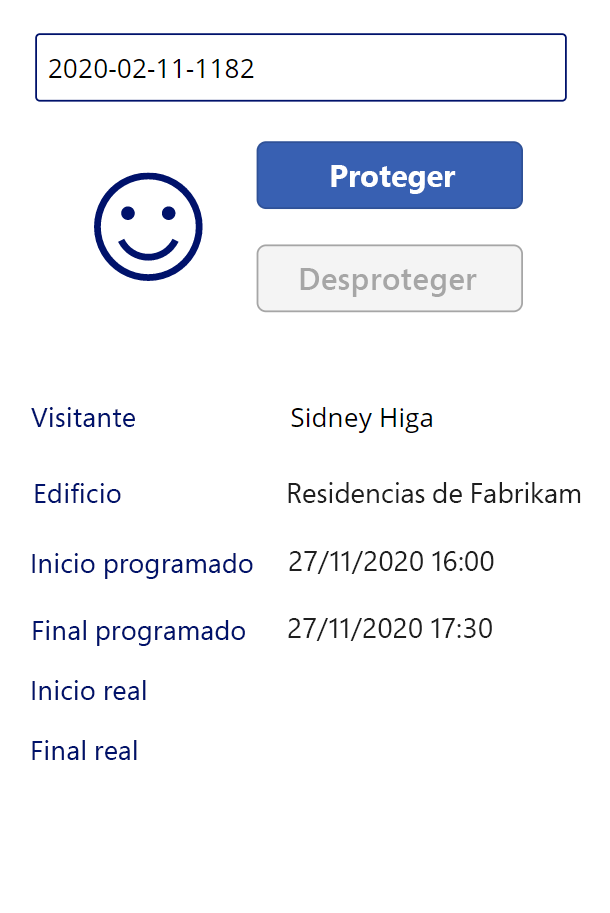

---
lab:
    title: 'Laboratorio 3: Cómo crear una aplicación de lienzo, parte 2'
    module: 'Módulo 3: Comience con Power Apps'
---

# Módulo 3: Comience con Power Apps
## Laboratorio 2: Cómo crear una aplicación de lienzo, parte 2

### Aviso importante (vigente a partir de noviembre de 2020):
Se ha cambiado el nombre de Common Data Service a Microsoft Dataverse. Parte de la terminología de Microsoft Dataverse se ha actualizado. Por ejemplo, ahora las entidades se llaman tablas. A partir de ahora, los campos y los registros de las bases de datos de Dataverse se denominarán columnas y filas.

Las aplicaciones están actualizando la experiencia del usuario, pero algunas referencias a la terminología de Microsoft Dataverse, como entidad (de ahora en delante **tabla**), campo (de ahora en adelante **columna**) y registro (de ahora en adelante **fila**) pueden no estar actualizadas. Tenga esto en cuenta cuando trabaje en los laboratorios. Esperamos poder actualizar completamente el contenido pronto.  

Si desea obtener más información y consultar la lista completa de los términos afectados, visite [¿Qué es Microsoft Dataverse?](https://docs.microsoft.com/es-es/powerapps/maker/common-data-service/data-platform-intro#terminology-updates).

# Escenario

Bellows College es una institución educativa que tiene un campus con varios edificios. Actualmente se guarda un registro físico de las visitas al campus. La información no se recaba de manera coherente y no hay forma de recopilar y analizar los datos sobre las visitas de todo el campus. 

La administración del campus querría modernizar el sistema de registro de visitantes de los edificios cuyo acceso esté controlado por el personal de seguridad y en los que los anfitriones deban anotar con antelación las visitas y dejar constancia de ellas.

A lo largo de este curso, creará aplicaciones e implementará la automatización para permitir que el personal de administración y seguridad de Bellows College administre y controle el acceso a los edificios en el campus. 

En la parte 2 de este laboratorio, creará, diseñará y compilará una aplicación de lienzo Power Apps que el personal de seguridad podrá utilizar en las entradas del edificio para confirmar y registrar rápidamente a los visitantes.

# Pasos de alto nivel del laboratorio

Seguirá el siguiente esquema para diseñar la aplicación de lienzo:

-   Crear la aplicación con el factor de forma del teléfono
-   Conectarse a Dataverse como origen de datos
-   Capturar la entrada (código de visitante) y ubicar la fila de visitante
-   Configurar un control de visor de formularios para mostrar la información del visitante
-   Usar una vista de Dataverse para rellenar la galería
-   Administrar el proceso de entrada y salida de un visitante

## Requisitos previos

* Haber finalizado el **Módulo 0, Laboratorio 0: Validación del entorno de laboratorio**
* Haber finalizado el **Módulo 2, Laboratorio 1: Introducción a Microsoft Dataverse**

## Cuestiones que conviene tener en cuenta antes de comenzar

-   ¿Para qué información necesitaría un responsable de seguridad tener acceso rápido?
-   ¿Qué debería pasar si el código de visitante no es válido?
-   ¿Qué debería pasar si el visitante llega fuera de las horas programadas?

# Ejercicio 1: Crear una aplicación de lienzo de seguridad

**Objetivo:** en este ejercicio aprenderá a crear una aplicación de lienzo.

## Tarea 1: Crear una aplicación de lienzo

1.  Abra la solución de Administración del campus.

    -   Inicie sesión en <https://make.powerapps.com>.

    -   Si el Entorno que se muestra en la parte superior derecha no es su Entorno de práctica, seleccione su **Entorno**. 

    -   Seleccione **Soluciones**.

    -   Haga clic para abrir la solución de **Administración del campus**.
    
2.  Cree una nueva aplicación de lienzo

    -   Haga clic en **Nuevo** y seleccione **Aplicación. \| Aplicación de lienzo \| Factor de forma del teléfono**.
        Esto abrirá el Editor de aplicaciones en una Nueva ventana.
        
    -   Haga clic en **Omitir** si se muestra con el cuadro de diálogo Bienvenido a Power Apps Studio.
    
3.  Guarde la aplicación de lienzo.

    -   Haga clic en **Archivo** y seleccione **Guardar como**.
    
    -   Compruebe si **La nube** está seleccionada. 
    
    -   Escriba **(Su apellido) Seguridad del campus** como Nombre y haga clic en **Guardar**.
        
    -   Haga clic en la flecha **Atrás** de la parte superior izquierda (debajo de Power Apps) para volver a la aplicación.

3.  Conectarse al origen de datos (Visitas)

    -   Haga clic en **Vista \| Orígenes de datos**
    
    -   Haga clic en **+Agregar datos**.

    -   Haga clic en **Ver todas las entidades** (o tablas).
    
    -   Seleccione **Visitas** y espere a que la tabla Visita se muestre debajo de la pestaña Datos.
    
4.  Para conservar el trabajo en curso, haga clic en **Archivo** y luego en **Guardar**. Utilice la flecha Atrás para volver a la aplicación.

## Tarea 2: Mostrar la información del visitante

1.  Agregue un cuadro de búsqueda

    -   Seleccione la pestaña **Vista de árbol** en la barra de navegación izquierda.
    
    -   Seleccione **Pantalla1**.
    
    -   Vaya a la pestaña **Insertar**.
    
    -   Haga clic en **Texto** y seleccione **Entrada de texto**.
    
2.  Edite el objeto de la entrada de texto

    -   Con el objeto de la entrada de texto seleccionado, seleccione el texto de la propiedad **Predeterminado** y borre el valor.
    
    -   Seleccione la propiedad **Sugerencia** y escriba `“Enter visitor code”` como valor (incluidas las comillas dobles).
    
    -   Haga clic en **...** junto al nombre del control en la vista de árbol (TextInput1), seleccione **Cambiar nombre** y cambie el nombre a `textCode`.
    
3.  Agregue una vista de formulario

    -   En la pestaña **Insertar**, haga clic en **Formularios**  y luego elija **Pantalla** (puede que deba hacer clic en la flecha que indica hacia abajo del lado derecho para ver Formularios).
   
    -   Arrastre el formulario a su posición y alinéelo con la parte inferior de la pantalla.
   
    -   Mientras selecciona el formulario nuevo, seleccione la propiedad **DataSource** y luego seleccione **Visitas**.
   
    -   En el panel Propiedades, seleccione **Horizontal** como **Diseño**.

4.  Edite la vista del formulario.

    -   Con el formulario nuevo aún seleccionado, haga clic en **Editar campos**.

    -   Quite los campos **Nombre** y **Creado en**.

    -   Haga clic en **Agregar campo** y seleccione los siguientes campos: **Fin real**, **Inicio real**, **Creación**, **Fin programado**, **Inicio programado**, **Visitante**
   
    -   Pulse **Agregar**.
   
    -   Para cambiar el orden de los campos seleccionados, arrastre las tarjetas de campo de la lista. El orden recomendado es el siguiente: Visitante, Edificio, Inicio programado, Fin programado, Inicio real, Fin real (puede contraer los campos para arrastrarlos más fácilmente).
   
    -   Haga clic en la **X** para cerrar el panel Campos
   
5.  Con la vista de formulario seleccionada, seleccione la pestaña Avanzado del panel Propiedades. Seleccione la propiedad **Elemento** y escriba `LookUp(Visits, Code = textCode.Text)` 

6.  Para conservar el trabajo en curso, haga clic en **Archivo** y luego en **Guardar**. Utilice la flecha Atrás para volver a la aplicación.

7.  Prepárese para probar la aplicación

    -   Vaya a la pestaña del explorador que contiene la solución.

    -   Haga clic en **Listo** en la ventana emergente.
   
    -   Seleccione la tabla **Visitas**.
   
    -   Seleccione la pestaña **Datos**.
   
    -   Para abrir el selector de vistas, en la parte superior derecha, haga clic en el nombre de la vista actual, **Visitas activas**.
   
    -   Cambie la vista a **Todas las columnas**.
   
    -   Busque una fila de visita que no tenga un valor de Inicio real o Fin real (por ejemplo, con las dos columnas en blanco). Seleccione y copie el **Código** para esta Visita.

8.  Pruebe la aplicación

    -   Vaya a la pestaña del explorador con la aplicación y pulse **F5** o haga clic en el icono **Reproducir** en la esquina superior derecha para obtener una versión preliminar de la aplicación.
   
    -   Pegue el valor copiado en el cuadro de texto de búsqueda y compruebe que el registro se muestra en el formulario.
   
9.  Borre el contenido del cuadro de texto de búsqueda.
   
10.  Pulse **ESC** para salir de la aplicación en ejecución.

## Tarea 3: Agregar botones de entrada y salida

En esta tarea, crearemos botones para que el usuario se registre y salga de su Visita. 

1. Guarde los resultados de búsqueda en una variable para reutilizarlos en el control.

    * Seleccione el control **textCode**.
   
    * En el panel Propiedades, seleccione la pestaña **Avanzado** y la propiedad **OnChange**.
   
    * Escriba la siguiente expresión: `Set(Visit, LookUp(Visits, Code = textCode.Text))`.
    
    > De esta forma, la visita se guardará en una variable global cuando un usuario busque en el cuadro de búsqueda de textCode. Esto nos permitirá usar la variable *Visit* en toda la aplicación sin necesidad de volver a escribir toda la expresión de búsqueda.

2. Agregue un botón de entrada

   * Seleccione la pestaña **Insertar**.
   
   * Haga clic en **Botón**.
   
   * En el panel Propiedades, cambie la propiedad **Texto** del botón a “`Check In`” (puede escribir dentro de las comillas existentes).
   
   * Haga clic en **...** junto al nombre del botón en una vista de árbol (Button 1), seleccione **Cambiar nombre** y cámbielo a `CheckInButton`.

3. Agregue un botón de salida.   

   * Haga clic en **Botón** en la pestaña Insertar para agregar otro botón.
   
   * En el panel Propiedades, cambie la propiedad **Texto** del botón a "`Check Out`" (puede escribir dentro de las comillas existentes).
   
   * Cambie el nombre del botón a `CheckOutButton`.
   
   * Coloque los botones debajo del cuadro de búsqueda, con **Entrada** encima de **Salida** 
   
## Tarea 4: Habilitar y deshabilitar botones según los datos de las visitas

Una vez que los usuarios han buscado la visita, queremos que utilicen el botón Entrada para registrarla. Nos gustaría habilitar el botón **Entrada** para cuando el registro de visita se haya localizado (es decir, que no esté en blanco), el estado del registro esté activo y la visita aún no haya comenzado, es decir, cuando el valor de inicio real esté en blanco.

1. Seleccione el **botón Entrada** y haga clic en la propiedad **Modo de presentación** del botón en la pestaña Propiedades.

2. Escriba la siguiente expresión en la barra de funciones:

      ```
      If(!IsBlank(Visit) 
      && Visit.Status = 'Status (Visits)'.Active
      && IsBlank(Visit.'Actual Start'),
          DisplayMode.Edit,
          DisplayMode.Disabled
      )
      ```

   La expresión se puede dividir de la siguiente manera:

   * **!IsBlank(Visit)**: se encontró el registro de visita
   * **&&**: operador lógico AND
   * **Visit.Status = 'Status (Visits)'.Active**: el estado del registro es *Activo*
   * **IsBlank(Visit.'Actual Start')**: el campo Inicio activo no contiene ningún dato
   * **DisplayMode.Edit, DisplayMode.Disabled**: si se cumplen las condiciones anteriores, el botón se podrá editar. De lo contrario, el botón permanecerá deshabilitado.

Nos gustaría habilitar el botón **Salida** para cuando el registro de visita se haya localizado (es decir, que no esté en blanco), el estado del registro esté activo y la visita ya haya comenzado, es decir, cuando el valor de inicio real no esté en blanco.

3. Seleccione el botón Salida y haga clic en la propiedad **Modo de presentación** del botón en la pestaña Propiedades.

4. Escriba la siguiente expresión en la barra de funciones:

     ```
     If(!IsBlank(Visit) 
     && Visit.Status = 'Status (Visits)'.Active
     && !IsBlank(Visit.'Actual Start'),
         DisplayMode.Edit,
         DisplayMode.Disabled
     )
     ```

5. Para conservar el trabajo en curso, haga clic en **Archivo** y luego en **Guardar**. Utilice la flecha Atrás para volver a la aplicación.

6. Pulse **F5** para ejecutar la aplicación. 

7. Ambos botones deben estar deshabilitados. Especifique el valor del código que copió anteriormente y pulse **Pestaña** para alejar el foco del cuadro de texto (o haga clic fuera del cuadro de texto). El botón **Entrada** debería estar habilitado. 

8. Borre el contenido del cuadro de búsqueda.

9. Pulse **ESC** para salir de la aplicación en ejecución.

## Tarea 5: Completar el proceso de entrada y salida

Para hacer el proceso de entrada y salida, debemos actualizar los datos de visita de Dataverse de la siguiente manera:

* Cuando el visitante se registre, establezca el campo *Inicio real* a la fecha y hora actuales.
* Cuando el visitante salga, configure el campo *Fin real* a la fecha y hora actuales. 
* Después de la salida, configure el estado del registro como inactivo para indicar que la visita se ha completado.

1. Seleccione el botón **Entrada**.

2. Establezca la propiedad **OnSelect** de la pestaña Avanzado a la siguiente expresión.

   ```
   Patch(
       Visits,
       Visitar,
       {'Inicio real': Now()}
   );
   Actualizar([@Visitas]);
   Establezca (Visita, Búsqueda (Visitas, Código = textCode.Text));
   ```

   Esta expresión contiene las siguientes partes:

   * **Patch(Visitas, Visita, {'Inicio real': Now()});**. El método *Patch* actualiza la tabla **Visitas**, la fila identificada por la variable **Visita** (que es la visita actual). La expresión establece el valor de la columna *Inicio real* a la fecha y hora actuales (*Now()* method).
   * **Refresh([@Visits]);**. Esta expresión actualiza las filas de visitas a medida que cambian los valores subyacentes
   * **Set(Visit, LookUp(Visits, Code = textCode.Text));**. Esta expresión actualiza la variable *Visita* con datos nuevos de Dataverse.
   
   > Cuando un usuario haga clic en este botón, el inicio real de la visita se establecerá en la fecha y hora actuales, y los datos se actualizarán.

3. Seleccione el botón **Salida**.

4. Establezca la propiedad **OnSelect** de la pestaña Avanzado a la siguiente expresión:

   ```
   Patch(
       [@Visitas],
       Visitar,
       {
           'Fin real': Ahora(),
           Estado: 'Estado (visitas)'.Inactivo
       }
   );
   Actualizar([@Visitas]);
   Establezca (Visita, Búsqueda (Visitas, Código = textCode.Text));
   ```

   Cuando un usuario haga clic en este botón, el fin real se establecerá en la fecha y hora actuales, el estado del registro de visita se establecerá como inactivo y los datos se actualizarán.

5. Para conservar el trabajo en curso, haga clic en **Archivo** y luego en **Guardar**. Utilice la flecha **Atrás** para volver a la aplicación.

6. Presione **F5** o haga clic en el botón Reproducir para ejecutar la aplicación. Especifique el valor del código que copió anteriormente y pulse **Pestaña** para alejar el foco del cuadro de texto. El botón **Entrada** debería estar habilitado.

7. Pulse el botón **Entrada**. Debería ocurrir lo siguiente:

   * El **Inicio real** se establece en la fecha y hora actuales
   
   * El botón **Entrada** está deshabilitado
   
   * El botón **Salida** está habilitado

8. Pulse el botón **Salida**.

   * El **Fin real** se establece en la fecha y hora actuales
   
   * Ambos botones están deshabilitados

9. Borre el contenido del cuadro de búsqueda.

10. Pulse **ESC** para salir de la aplicación en ejecución.

## Tarea 6: Agregar indicadores visuales

La facilidad de uso de una aplicación móvil mejora significativamente cuando se agregan indicadores visuales. En esta tarea agregaremos un icono que indique si un visitante puede registrarse o no.

1. Seleccione la pestaña **Insertar**.

2. Seleccione **Iconos \| Agregar**. Seleccione un icono. En este punto, no importa qué icono seleccionemos, ya que queremos que el valor sea dinámico.

3. Cambie el tamaño del icono y colóquelo a la izquierda de los botones.

4. En la pestaña Avanzado del icono, seleccione la propiedad **Icono** (en la sección Diseño) y escriba la siguiente expresión:

   ```
   If(
      CheckInButton.DisplayMode = DisplayMode.Disabled 
   && CheckOutButton.DisplayMode = DisplayMode.Disabled,
       Icon.EmojiFrown,
       Icon.EmojiSmile
   )
   ```

5. Para conservar el trabajo en curso, haga clic en **Archivo** y luego en **Guardar**. Utilice la flecha **Atrás** para volver a la aplicación.

6. Pulse **F5** para ejecutar la aplicación. Especifique el valor del código que copió anteriormente y pulse **Pestaña** para alejar el foco del cuadro de texto. Compruebe que el icono muestra un emoji con el ceño fruncido.

7. Busque un valor de código diferente que no se haya utilizado antes (no debe tener un valor de Inicio real o Fin real). 

    > Puede ir a la pestaña anterior para copiar otro Código de una de las Visitas que creó. También puede ejecutar la aplicación **Personal del campus**, creada previamente, para crear nuevos registros de visitas. Compruebe que el icono muestra un emoji sonriente para este código.

La aplicación en ejecución debería verse aproximadamente de esta manera:



8. Pulse **ESC** para salir de la aplicación en ejecución.

## Tarea 7: Publicar la aplicación

1. Debe tener la aplicación Seguridad del campus todavía abierta en su explorador. De no ser así, seleccione la aplicación **Seguridad del campus** y haga clic en **Editar**.

2. Seleccione **Archivo \| Publicar** 

3. Seleccione **Publicar esta versión**

# Retos

* Evite la entrada manual del código de visita
* Agregue una validación de creación para la visita
* Agregue una validación del tiempo real de la visita frente al tiempo programado de la visita (demasiado temprano, demasiado tarde, etc.)
* Agregue el estado detallado de la visita, por ejemplo, la visualización del correo electrónico y la validación para el visitante, la razón para denegar el acceso al edificio, etc.
* Múltiples edificios/reuniones/controles durante una sola visita al campus. Por ejemplo, una persona puede visitar el campus por un día y durante ese día se reunirá con miembros del personal en varios edificios a diferentes horas del día. ¿Consideraría agregar la entidad *cita* a la solución?
