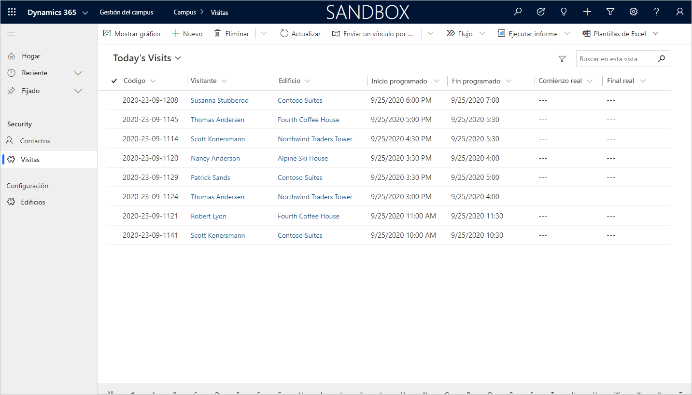

---
lab:
    title: 'Laboratorio 4: Cómo crear una aplicación basada en modelo'
    module: 'Módulo 3: Comience con Power Apps'
---

# Módulo 3: Comience con Power Apps
## Laboratorio 3: Cómo crear una aplicación basada en modelo

### Aviso importante (vigente a partir de noviembre de 2020):
Se ha cambiado el nombre de Common Data Service a Microsoft Dataverse. Parte de la terminología de Microsoft Dataverse se ha actualizado. Por ejemplo, ahora las entidades se llaman tablas. A partir de ahora, los campos y los registros de las bases de datos de Dataverse se denominarán columnas y filas.

Las aplicaciones están actualizando la experiencia del usuario, pero algunas referencias a la terminología de Microsoft Dataverse, como entidad (de ahora en delante **tabla**), campo (de ahora en adelante **columna**) y registro (de ahora en adelante **fila**) pueden no estar actualizadas. Tenga esto en cuenta cuando trabaje en los laboratorios. Esperamos poder actualizar completamente el contenido pronto. 

Si desea obtener más información y consultar la lista completa de los términos afectados, visite [¿Qué es Microsoft Dataverse?](https://docs.microsoft.com/es-es/powerapps/maker/common-data-service/data-platform-intro#terminology-updates).

# Escenario

Bellows College es una institución educativa que tiene un campus con varios edificios. Los visitantes del campus están actualmente registrados en registros en papel. La información no se recaba de manera coherente y no hay forma de recopilar y analizar los datos sobre las visitas de todo el campus. 

La administración del campus querría modernizar el sistema de registro de visitantes de los edificios cuyo acceso esté controlado por el personal de seguridad y en los que los anfitriones deban anotar con antelación las visitas y dejar constancia de ellas.

A lo largo de este curso, creará aplicaciones e implementará la automatización para permitir que el personal de administración y seguridad de Bellows College administre y controle el acceso a los edificios en el campus. 

En este laboratorio, creará una aplicación basada en el modelo de Power Apps para permitir que el personal del campus administrativo administre los registros de visitas en todo el campus.

# Pasos de alto nivel del laboratorio

Como parte de la creación de la aplicación basada en modelo, deberá hacer lo siguiente:

-   Crear una nueva aplicación basada en modelo llamada Administración del campus

-   Editar la navegación de la aplicación para hacer referencia a las tablas requeridas

-   Personalizar los formularios y las vistas de las tablas requeridas para la aplicación

Trabajaremos con los siguientes componentes:

- **Vistas**: las vistas permiten al usuario mostrar los datos existentes en la tabla del formulario.

- **Formularios**: aquí el usuario crea/actualiza nuevas filas en las tablas.

Ambos se integrarán a la aplicación basada en modelo para mejorar la experiencia del usuario.

## Requisitos previos

* Haber finalizado el **Módulo 0, Laboratorio 0: Validación del entorno de laboratorio**
* Haber finalizado el **Módulo 2, Laboratorio 1: Introducción a Microsoft Dataverse**

## Cuestiones que conviene tener en cuenta antes de comenzar

-   ¿Qué cambios debemos hacer para mejorar la experiencia del usuario?

-   ¿Qué deberíamos incluir en una aplicación basada en modelo elaborada según el modelo de datos que hemos construido?
    
-   ¿Qué personalizaciones se pueden hacer en el mapa del sitio de una aplicación basada en modelo?

# Ejercicio 1: Personalizar vistas y formularios

**Objetivo:** en este ejercicio, personalizará las vistas y formularios de las tablas creadas de manera personalizada que se utilizarán en la aplicación basada en modelo.

## Tarea 1: Editar el formulario de visita

1.  Inicie sesión en <https://make.powerapps.com> si aún no lo ha hecho.

2.  Seleccione su **Entorno**.

3.  Seleccione **Soluciones**.

4.  Haga clic para abrir la solución de **Administración del campus**.

5.  Haga clic para abrir la entidad **Visita**.

6.  Seleccione la pestaña **Formularios** y seleccione para abrir el tipo de formulario **Principal**. 

    > Por defecto, el formulario tiene dos campos: Nombre (campo principal) y Propietario.
    
7.  Seleccione **+ Campo de formulario** y agregue los siguientes campos debajo del campo **Propietario**. Para ello, arrastre las columnas hasta el formulario o simplemente haga doble clic en los nombres de columna:

    * **Edificio**
    * **Visitante**
    * **Inicio programado**
    * **Fin programado**
    * **Inicio real**
    * **Fin real** 
    
8.  Arrastre el campo **Código** y suéltelo en el encabezado del formulario. 

    > El encabezado está en la parte superior derecha del formulario. Es posible que deba minimizar el panel Propiedades del lado derecho de la pantalla para ver el campo en el formulario.

9.  Con el campo **Código** seleccionado, marque la casilla de verificación **Solo lectura** en el panel Propiedades.

10.  Seleccione el campo **Propietario**. En el panel Propiedades, cambie la **Etiqueta de campo** a **Host**.

11.  Haga clic en **Guardar** en la parte superior derecha y espere a que se termine de guardar.

12.  Haga clic en **Publicar** en la parte superior derecha y espere hasta que termine de publicarse.

13.  Haga clic en **Atrás** en la parte superior izquierda de la pantalla. Debería haber vuelto a la
     entidad Visita de la pestaña Formularios.

## Tarea 2: Editar las vistas de las visitas

En esta tarea, modificaremos la vista predeterminada de Visitas activas y crearemos una nueva vista para las visitas de hoy.

1.  Seleccione la pestaña **Vistas** y haga clic para abrir la vista **Visitas activas**.

2.  Para agregar los siguientes campos a la vista, haga clic o arrastre y suelte los campos:

    *  **Código**
    *  **Visitante**
    *  **Edificio**
    *  **Inicio programado** 
    *  **Fin programado**
    
3.  Haga clic en la columna **Creado en** y seleccione **Quitar**. Ahora el campo **Creado en** se quitará de la vista.

4.  Haga clic en la columna **Nombre** y seleccione **Quitar**. Ahora el campo **Nombre** se quitará de la vista.

5.  En el panel de Propiedades, a la derecha, haga clic en **Ordenar por...** y seleccione **Inicio programado**. Haga clic en **Inicio programado** otra vez para cambiar el orden a descendente.

6.  Cambie el tamaño de los anchos de las columnas individuales para ajustarlos a los datos.

7.  Haga clic en **Guardar** y espere hasta que se guarden los cambios.

8.  Haga clic en **Publicar** y espere a que se complete la publicación.

Ahora clonaremos la vista para crear una nueva para las visitas de hoy.

9.  Pulse el vínculo **Editar filtros** en el panel Propiedades.

10.  Haga clic en **Agregar** y seleccione **Agregar fila**.

11.  Seleccione **Inicio programado** como campo y luego **Hoy** como condición en el menú desplegable. 

12.  Haga clic en **...** en la fila **Estado** y haga clic en **Eliminar**. 

13.  Pulse **Aceptar** para guardar la condición. Ahora la vista está filtrada para mostrar solo los registros donde la fecha de inicio programada es hoy.

14.  Agregue los campos **Inicio real** y **Fin real** a la vista. 

>**Nota:** Como ya no filtramos el estado de la vista, obtendremos todas las visitas de hoy, incluidas las completadas. Estos campos ayudarán a diferenciar las visitas completadas de las visitas en curso.

15.  Haga clic en la **flecha desplegable** situada junto al botón Guardar (tenga cuidado de no presionar el botón) y seleccione **Guardar como**.

16.  Cambie el nombre a **Visitas de hoy** y pulse **Guardar**.

17.  Haga clic en **Publicar** y espere a que se complete la publicación.

# Ejercicio 2: Crear una aplicación basada en modelo

**Objetivo:** en este ejercicio creará la aplicación basada en modelo, personalizará el mapa del sitio y probará la aplicación.

> Verá varios campos que no se comentarán a medida que desarrolla su aplicación, sobre todo en los pasos correspondientes al mapa del sitio. Hemos tomado algunos atajos para hacer los laboratorios. En una implementación real, debería dar a estos elementos nombres lógicos.

## Tarea 1: Crear la aplicación

1.  Abra la solución de Administración del campus si aún no está en ella.

    -   Inicie sesión en <https://make.powerapps.com>.

    -   Mientras esté en su entorno, haga clic para abrir la solución de **Administración del campus**
        .
    
2.  Cree la aplicación basada en modelos

    -   Haga clic en **Nuevo**, seleccione **Aplicación** y luego **Aplicación basada en modelo**. Esta acción abrirá una nueva ventana.
    
    -   Escriba **[Su apellido] Administración del campus** para Nombre.

    -   Seleccione la casilla de verificación **Usar solución existente para crear la aplicación**.

    -   Seleccione **Siguiente**.

    -   Seleccione la solución **Administración del campus**.
    
    -   Haga clic en **Listo**.
    
3.  Haga clic en el icono de lápiz junto al **Mapa del sitio**.

4.  Edite los títulos predeterminados

    -   Seleccione **Nueva área**.

    -   Cambie el título de la nueva área a **Campus** en el panel de propiedades de la derecha.

    -   Seleccione **Nuevo grupo**.

    -   Cambie el título del nuevo grupo a **Seguridad** en el panel de propiedades de la derecha.
    
5.  Agregue la tabla Contacto al mapa del sitio.

    -   Seleccione **Nueva subárea**.

    -   En el panel **Propiedades**, seleccione **Entidad** en el menú desplegable
        para **Tipo**.

    -   Busque la tabla **Contacto** en la lista desplegable para **Entidad**.
    
6.  Agregue la tabla Visita al mapa del sitio.

    -   Seleccione el grupo **Seguridad** y haga clic en **Agregar**.

    -   Seleccione **Subárea**.

    -   Vaya al panel **Propiedades**.

    -   Seleccione **Entidad** en el menú desplegable para **Tipo** y busque
        la tabla **Visita** en la lista desplegable para **Entidad**.
    
7.  Agregue la tabla Edificio al mapa del sitio.

    -   Seleccione el área **Campus** y haga clic en **Agregar**.
    
    -   Seleccione **Grupo**.
    
    -   Especifique **Configuraciones** para **Título** en el panel **Propiedades**.
    
    -   Con el área **Configuración** seleccionada, haga clic en **Agregar**.
    
    -   Seleccione **Subárea**.
    
    -   Vaya al panel **Propiedades**.
    
    -   Seleccione **Entidad** en la lista desplegable para **Tipo** y busque la tabla **Edificio** en la lista desplegable para **Entidad**.

8.  Haga clic en **Guardar**. Ahora se mostrará la pantalla de carga mientras se guardan los cambios.

9.  Haga clic en **Publicar** todas las personalizaciones y espere a que se complete la publicación.

10.  Haga clic en **Guardar y cerrar** para cerrar el editor del mapa de sitio. 

> Verá que los activos de las entidades que se han agregado al mapa del sitio ahora están en la aplicación.
     
11.  Haga clic en **Guardar** en el Diseñador de aplicaciones.

12.  Haga clic en **Validar** para validar los cambios realizados en la aplicación. 

>  Esto hará que se muestren algunas advertencias, pero podemos ignorarlas, ya que no hemos hecho referencia a una Vista y un Formulario específicos para las entidades, y los usuarios tendrán acceso a todas las Vistas y Formularios para las entidades **Visita**y**Edificio**.
     
13. Haga clic en **Publicar**.

14.  Haga clic en **Guardar y cerrar** para cerrar el diseñador de la aplicación.

15.  Haga clic en **Listo**.

16.  Seleccione **Soluciones** y luego **Publicar todas las personalizaciones**.

17.  Seleccione **Aplicaciones**; su aplicación ahora debería estar en la lista.

## Tarea 2: Probar la aplicación

1.  Inicie la aplicación

    -   Seleccione **Aplicaciones** y haga clic en su aplicación **Administración del campus** (si no ve su aplicación, es posible que deba actualizar el explorador).

    -   La aplicación debería abrirse en una nueva ventana.
    
2.  Cree un nuevo Contacto

    -   La aplicación debería abrirse en la vista **Contactos activos**.

    -   Haga clic en **Nuevo** en el menú superior.

    -   Establezca el **Nombre** como `John` y el **Apellido** como `Doe`.

    -   Establezca su correo electrónico personal como **Correo electrónico**. Se utilizará en un laboratorio futuro. 
    
    -   Haga clic en **Guardar y cerrar**.

    -   Ahora debería poder ver el contacto creado en la vista **Contactos activos**.
    
3.  Cree un nuevo edificio

    -   Seleccione **Edificios** en el mapa del sitio.

    -   Haga clic en **Nuevo**.

    -   Escriba el **Nombre** como `Microsoft Building`.
        
    -   Haga clic en **Guardar y cerrar**. Esto hará que se muestre el registro recién creado en
        la vista de Edificios activos.
    
4.  Cree una nueva visita

    -   Seleccione **Visitas** del mapa del sitio.
    
    -   Haga clic en **Nuevo**.
    
    -   Especifique los campos de la siguiente forma 
    
        -   **Nombre**: `New test visit`
        -   **Edificio**: seleccione Microsoft Building
        -   **Visitante**: seleccione John Doe
        -   **Inicio programado**: seleccione la fecha de mañana y las 14:00 como hora de inicio
        -   **Fin programado**: seleccione la fecha de mañana y las 15:30 como hora de finalización
        
    -   Haga clic en **Guardar y cerrar**. De esta forma se creará el registro, y debería poder verlo en la
        vista de Visitas activas.
        
    -   Cambie la vista a **Visitas de hoy**. Ya no debería poder ver la nueva visita en la vista, ya que está programada para mañana.
    
5. Puede agregar más registros de prueba.

   La aplicación en ejecución debería verse aproximadamente de esta manera:

# Retos

* Seleccione vistas y formularios específicos para Visitas y Edificios
* El personal de seguridad generalmente trabaja en un solo edificio. ¿Cómo les ofrecería una manera fácil de mostrar las visitas solo para un edificio seleccionado?
* Restrinja el acceso a entidades específicas, por ejemplo, los Edificios deben ser de solo lectura para todos los miembros del personal, excepto los administradores.
* ¿Qué paneles consideraría agregar a la aplicación?
