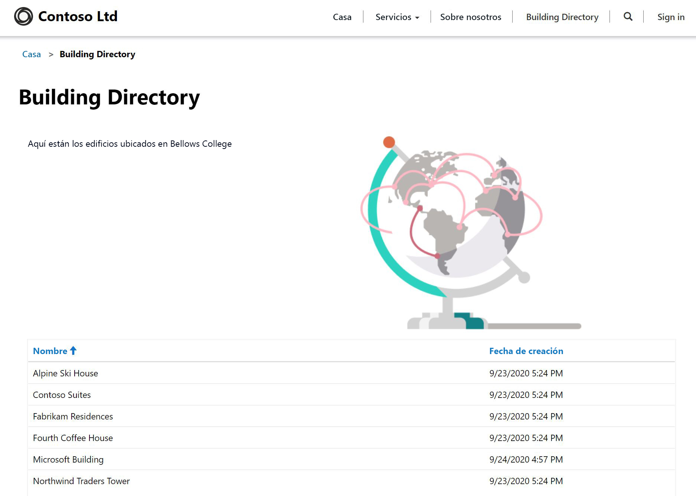

---
lab:
    title: 'Laboratorio 5: Cómo crear un portal de Power Apps'
    module: 'Módulo 3: Comience con Power Apps'
---

# Módulo 3: Comience con Power Apps

## Laboratorio 4: Cómo crear un portal de Power Apps

### Aviso importante (vigente a partir de noviembre de 2020):
Se ha cambiado el nombre de Common Data Service a Microsoft Dataverse. Parte de la terminología de Microsoft Dataverse se ha actualizado. Por ejemplo, ahora las entidades se llaman tablas. A partir de ahora, los campos y los registros de las bases de datos de Dataverse se denominarán columnas y filas.

Las aplicaciones están actualizando la experiencia del usuario, pero algunas referencias a la terminología de Microsoft Dataverse, como entidad (de ahora en delante **tabla**), campo (de ahora en adelante **columna**) y registro (de ahora en adelante **fila**) pueden no estar actualizadas. Tenga esto en cuenta cuando trabaje en los laboratorios. Esperamos poder actualizar completamente el contenido pronto. 

Si desea obtener más información y consultar la lista completa de los términos afectados, visite [¿Qué es Microsoft Dataverse?](https://docs.microsoft.com/es-es/powerapps/maker/common-data-service/data-platform-intro#terminology-updates).

# Escenario

Bellows College es una institución educativa que tiene un campus con varios edificios. Actualmente se guarda un registro físico de las visitas al campus. La información no se recaba de manera coherente y no hay forma de recopilar y analizar los datos sobre las visitas de todo el campus.

La administración del campus desea ofrecer a los visitantes información sobre los edificios del campus. Los visitantes podrán ver la lista de edificios en un sitio web, que se creará con un portal de Power Apps.

En este laboratorio, aprovisionará un portal de Power Apps y creará una página web de portales que mostrará una lista de los edificios del campus.

# Pasos de alto nivel del laboratorio

Deberá seguir el siguiente esquema para diseñar el portal de Power Apps:

* Aprovisionar un portal de Power Apps en el entorno de Dataverse
* Crear y configurar una página web para mostrar una lista de los edificios
* Crear un tema nuevo y aplicarlo al portal

## Requisitos previos

* Haber finalizado el **Módulo 0, Laboratorio 0: Validación del entorno de laboratorio**
* Haber finalizado el **Módulo 2, Laboratorio 1: Introducción a Microsoft Dataverse**

## Cuestiones que conviene tener en cuenta antes de comenzar

* Las aplicaciones de los portales de Power Apps siempre se inician desde una plantilla en lugar de una aplicación en blanco. Debería haber creado su portal en el Laboratorio 0 del Módulo 0. Una vez haya aprovisionado un portal, tendrá páginas, menús y un tema predeterminado. 

# Ejercicio 1: Crear la Página web de portal

**Objetivo:** en este ejercicio, creará una nueva página web que mostrará contenido estático y una lista de edificios de Dataverse.

## Tarea 1: Ir al portal

1.  Vaya a <https://make.powerapps.com>.

2.  Compruebe que se encuentra en el Entorno de práctica. Si no lo está, cambie el entorno en la parte superior derecha.

3.  Haga clic en **Aplicaciones**.

4.  Busque la aplicación que indica el **Tipo** de **Portal**.

5.  Haga clic en el nombre de la aplicación para abrir el portal.

    > Esto debería redirigirle a la página de aterrizaje del sitio web de su portal, en la que habrá un mensaje de bienvenida. Navegue por el portal para ver lo que se ha creado de manera predeterminada al aprovisionarlo. 

## Tarea 2: Crear una página web

1.  Abra Studio de portales de Power Apps

    -   Inicie sesión en <https://make.powerapps.com> (es posible que todavía puede lo tenga abierto en sus pestañas).

    -   Seleccione **Aplicaciones**
    
    -   Busque la aplicación que indica el **Tipo** de **Portal**.

    -   Haga clic en los puntos suspensivos (**...**) a la derecha del nombre de la aplicación del portal y seleccione **Editar**.

    > Ahora se encuentra en Studio de portales de Power Apps. Aquí puede modificar y crear el contenido del portal.

2.  Cree una nueva página

    -   En la barra de comandos, seleccione **Nueva página**.

    -   Coloque el ratón sobre **Diseños fijos** y seleccione **Página con título**.

3.  En el panel Propiedades, bajo **Mostrar**, cambie el **Nombre** de **Página nueva (1)** a `Building Directory`.

4.  En la **URL parcial**, cambie el valor a `building-directory` y pulse la tecla Tabulación para iniciar el guardado automático.

    > El título de la página ahora debería ser **Directorio de edificios**.
    
## Tarea 3: Agregar contenido estático

1.  Agregue una sección a la página web

    -   En el lienzo (área que muestra la página web), seleccione la sección **Copia de página**. Es el cuadro grande alrededor de las 2 frases de texto que hay en el medio de la página.

    -   En el cinturón de herramientas (lado izquierdo), seleccione el icono**Componentes**.

    -   Seleccione **Sección de dos columnas** desde el área **Diseño de sección**.

2.  Agregue un texto estático

    -   En el lienzo (área que muestra la página web), seleccione la columna de la izquierda.

    -   En el cinturón de herramientas (lado izquierdo), seleccione el icono**Componentes**.

    -   Seleccione **Texto** desde el área **Componentes del portal**.

    -   En la nueva área de texto, escriba lo siguiente:
          ```
          The following is the building directory.
          ```
    -   Seleccione el cuadro de texto sobre el que acaba de editar y haga clic en **Eliminar** en la barra de comandos para quitar el texto predeterminado.

3. Agregue una imagen

    -   En el lienzo (área que muestra la página web), seleccione la columna de la derecha.

    -   En el cinturón de herramientas (lado izquierdo), seleccione el icono**Componentes**.

    -   Elija **Imagen** desde el área **Componentes del portal**.

    -   En el panel Propiedades, haga clic en **Seleccionar una imagen**. Busque y seleccione el **Producto A.png**.
    
    -   En el panel Propiedades, haga clic en el menú desplegable de la sección **Formato** y cambie el **Ancho** al 70 % (asegúrese de escribir el %). Puede jugar con el tamaño de la imagen hasta que quede como desee.

4.  Haga clic en **Navegar por el sitio web** para ver la página tal y como está por el momento.  Fíjese que ahora en el menú principal aparece la opción **Directorio de edificios**.

    > Es posible que deba configurar su explorador para permitir que aparezcan las ventanas emergentes.

## Tarea 4: Agregar un componente de lista

1.  Vaya a la pestaña anterior y continúe con el paso 2. Si no está disponible, siga los pasos que se indican a continuación para regresar a esta ubicación.

    -   Inicie sesión en <https://make.powerapps.com> (es posible que todavía puede lo tenga abierto en sus pestañas).

    -   Busque la aplicación que indica el **Tipo** de **Portal**.

    -   Haga clic en los puntos suspensivos (**...**) y seleccione **Editar**.
    
    -   En el cinturón de herramientas (lado izquierdo), seleccione la opción **Páginas**. 

    -   Busque y seleccione la página **Directorio de edificios** que creó anteriormente.
    
2.  Agregue un componente de lista a la página Directorio de edificios.

    -   Seleccione la sección con dos columnas.

    -   En el cinturón de herramientas (lado izquierdo), seleccione el icono**Componentes**.

    -   Seleccione **Sección de una columna** desde el área **Diseño de sección** (aparecerá una sección debajo de la imagen y el texto en la página web).

    -   Seleccione la nueva sección de columna en el lienzo.

    -   En el cinturón de herramientas (lado izquierdo), seleccione el icono**Componentes**.

    -   Seleccione **Lista** desde el área **Componentes del portal** (aparecerá un componente de lista en la nueva sección).
    
3.  Configure el componente de lista.

    -   Seleccione el componente de lista en el lienzo

    -   En el panel Propiedades (lado derecho), escriba `Buildings List` en el campo **Nombre**.

    -   En el campo **Tabla**, seleccione **Edificios (bc_edificio)** en la lista desplegable.

    -   En **Vistas**, seleccione **Edificios activos**.

    -   Deje el resto de la configuración como predeterminada.
    
4.  Haga clic en **Navegar por el sitio web** para ver la página. 

    > Debería poder ver la lista de Edificios de la base de datos de Dataverse en la página web.

# Ejercicio 2: Cambiar el tema del portal

**Objetivo:** en este ejercicio, creará un nuevo tema que modificará el esquema de color de su portal. 

## Tarea 1: Aplicar y editar un tema

1.  Vaya a la pestaña anterior y continúe con el paso 2. Si no está disponible, siga los pasos que se indican a continuación para regresar a esta ubicación.

    -   Inicie sesión en <https://make.powerapps.com> (es posible que todavía puede lo tenga abierto en sus pestañas).

    -   Busque la aplicación que indica el **Tipo** de **Portal**.

    -   Haga clic en los puntos suspensivos (**...**) y seleccione **Editar**.
    
2.  Aplique y personalice un tema básico

    -   En el cinturón de herramientas (lado izquierdo), seleccione el icono **Temas**.
    
    -   Haga clic en la tecla de alternancia **Habilitar tema básico** para activar esta característica.
    
    -   En uno de los ajustes preestablecidos, haga clic en los puntos suspensivos(**...**) y seleccione **Personalizar**.
    
    -   Se habrá creado una copia del tema básico. 
    
    -   En el panel Propiedades, pruebe a cambiar los colores y compruebe el efecto de estos cambios en el portal.
    
    -   Cambie el nombre de su tema
    
3.  En la barra de comandos, haga clic en **Configuración de sincronización**.

El diseño de la aplicación debería ser similar a la siguiente estructura:



# Retos

* Cree una vista diferente de Edificios que solo muestre el Nombre del edificio. Deberá seleccionar **Navegar por el sitio web** desde el portal Studio para ver los cambios.
* En el cinturón de herramientas, haga clic en el icono **Temas** y edite el CSS del tema personalizado.
* Cree una página con el componente **Formulario** y modifique un componente de **Lista** para agregar o editar filas de Dataverse con el formulario.
* Habilite **Permisos de entidad** en **Configuración** de un componente de **Lista**. ¿Qué pasa con los datos?
* En el portal de Studio, seleccione el icono del Editor de código fuente `</>` para ver el origen de la página. Si se siente cómodo con HTML, haga algunas modificaciones y compruebe los resultados.
