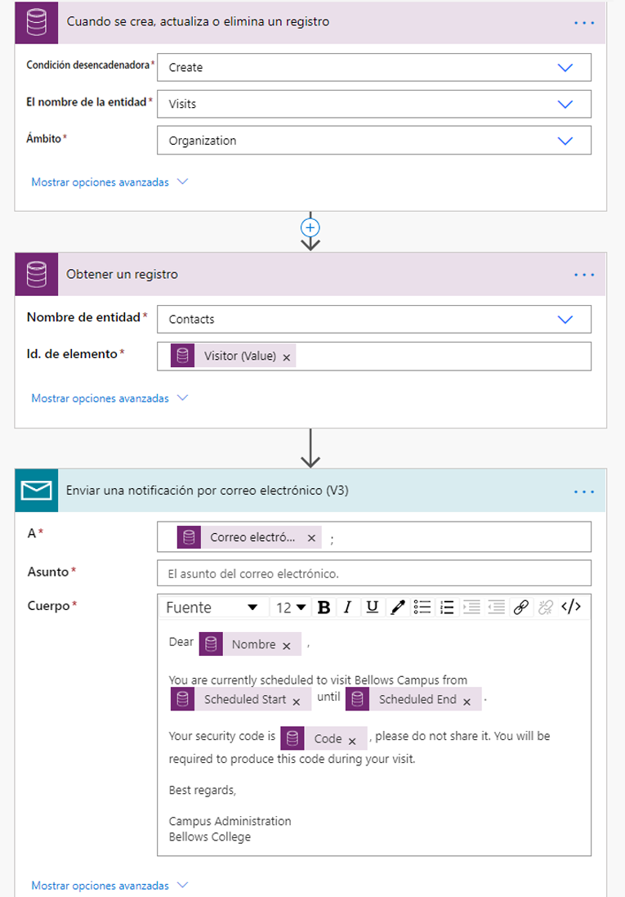
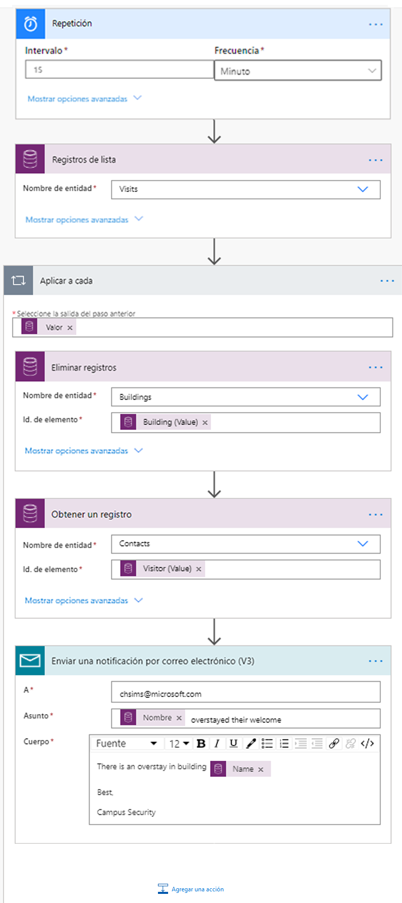

---
lab:
    title: 'Laboratorio 6: Cómo crear una solución automatizada'
    module: 'Módulo 4: Comenzar con Power Automate'
---

# Módulo 4: Comenzar con Power Automate
## Laboratorio: Cómo crear una solución automatizada

### Aviso importante (vigente a partir de noviembre de 2020):
Se ha cambiado el nombre de Common Data Service a Microsoft Dataverse. Parte de la terminología de Microsoft Dataverse se ha actualizado. Por ejemplo, ahora las entidades se llaman tablas. A partir de ahora, los campos y los registros de las bases de datos de Dataverse se denominarán columnas y filas.

Las aplicaciones están actualizando la experiencia del usuario, pero algunas referencias a la terminología de Microsoft Dataverse, como entidad (de ahora en delante **tabla**), campo (de ahora en adelante **columna**) y registro (de ahora en adelante **fila**) pueden no estar actualizadas. Tenga esto en cuenta cuando trabaje en los laboratorios. Esperamos poder actualizar completamente el contenido pronto. 

Si desea obtener más información y consultar la lista completa de los términos afectados, visite [¿Qué es Microsoft Dataverse?](https://docs.microsoft.com/es-es/powerapps/maker/common-data-service/data-platform-intro#terminology-updates).

## Escenario

Bellows College es una institución educativa que tiene un campus con varios edificios. Los visitantes del campus están actualmente registrados en registros en papel. La información no se recaba de manera coherente y no hay forma de recopilar y analizar los datos sobre las visitas de todo el campus. 

La administración del campus querría modernizar el sistema de registro de visitantes de los edificios cuyo acceso esté controlado por el personal de seguridad y en los que los anfitriones deban anotar con antelación las visitas y dejar constancia de ellas.

A lo largo de este curso, creará aplicaciones e implementará la automatización para permitir que el personal de administración y seguridad de Bellows College administre y controle el acceso a los edificios en el campus. 

En este laboratorio, creará flujos de Power Automate para automatizar varias partes de la administración del campus. 

# Pasos de alto nivel del laboratorio

Se han identificado las siguientes condiciones como requisitos que debe implementar para completar el proyecto:

* El código único asignado a cada visitante debe estar disponible antes de su visita.
* El personal de seguridad necesita recibir notificaciones de los visitantes que se queden durante más tiempo que la franja horaria programada.

## Requisitos previos

* Haber finalizado el **Módulo 0, Laboratorio 0: Validación del entorno de laboratorio**
* Haber finalizado el **Módulo 2, Laboratorio 1: Introducción a Microsoft Dataverse**
* Aplicación Personal del campus creada en el **Módulo 3, Laboratorio 2: Cómo crear una aplicación de lienzo, parte 2** (para pruebas)
* Contacto de John Doe creado con una dirección de correo electrónico personal en el **Módulo 3, Laboratorio 4: Cómo crear una aplicación basada en modelo** (para pruebas)

## Cuestiones que conviene tener en cuenta antes de comenzar

-   ¿Cuál es el mecanismo de distribución más apropiado para los códigos de visitante?
-   ¿Cómo se pueden medir las estancias prolongadas y aplicar directivas estrictas?

# Ejercicio 1: Crear un flujo de notificación de visita

**Objetivo:** en este ejercicio, creará un flujo de Power Automate que implemente el requisito. El visitante debe recibir un correo electrónico que incluya el código único asignado a la visita.

## Tarea 1: Crear el flujo

1.  Abra la solución de Administración del campus.

    -   Inicie sesión en <https://make.powerapps.com>.

    -   Seleccione su **entorno**.

    -   Seleccione **Soluciones**.

    -   Haga clic para abrir la solución de **Administración del campus**.

2.  Haga clic en **Nuevo** y seleccione **Flujo de nube**. Se abrirá el editor de flujo de Power Automate en una nueva ventana.

3. Busque *Actual* y seleccione el conector **Common Data Service (entorno actual)**.

4. Seleccione el desencadenador **Cuando se crea, actualiza o elimina un registro**.

   * Seleccione **Crear** para **Desencadenar la condición**.
   
   * Seleccione **Visitas** para el **Nombre de la tabla**.
   
   * Seleccione **Organización** para el **Ámbito**.
   
   * Durante el paso de desencadenamiento, haga clic en los puntos suspensivos (**...**) y en **Cambiar nombre**. Cambie el nombre de este desencadenador a **“Cuando se crea una visita”**. Esta es una buena manera de que usted y otros editores de flujo puedan comprender el propósito del paso sin tener que profundizar en los detalles.

5.  Haga clic en **Nuevo paso**. Este paso es necesario para recuperar la información de los visitantes, incluida la dirección de correo electrónico.

6. Busque *Actual* y seleccione el conector **Common Data Service (entorno actual)**.

7. Seleccione la acción **Obtener una fila por id.**. 

   * Seleccione **Contactos** como **Nombre de la tabla**.
   
   * En el campo **Id. de fila**, seleccione **Visitante (valor)** de la Lista de contenido dinámico.
   
   * En esta acción, haga clic en los puntos suspensivos (**...**) y en **Cambiar nombre**. Cambie el nombre de esta acción a **“Obtener visitante”**. Esta es una buena manera de que usted y otros editores de flujo puedan comprender el propósito del paso sin tener que profundizar en los detalles.

8. Haga clic en **Nuevo paso**. Este es el paso que creará y enviará un correo electrónico al visitante.

9. Busque el *correo electrónico*, seleccione el conector **Correo electrónico** y la acción **Enviar una notificación por correo electrónico**. 

   * Si se le pide que acepte los términos y condiciones para usar esta acción, haga clic en **Aceptar**.
   
   * Seleccione los campos **Para** y **Correo electrónico** en la Lista de contenido dinámico. Observe que se encuentra debajo del encabezado **Obtener visitante**. Esto significa que está seleccionando el correo electrónico relacionado con el visitante que buscó en el paso anterior. 

   * Escriba **Su visita programada a Bellows College** en el campo **Asunto**.

   * Escriba el siguiente texto en el **Cuerpo del correo electrónico**:  
        
        > El contenido dinámico debe colocarse donde se nombran los campos entre paréntesis. Se recomienda copiar y pegar todo el texto primero y, luego, agregar el contenido dinámico en los lugares correctos.
   
        ```
        Dear {First Name},

        You are currently scheduled to visit Bellows Campus from {Scheduled Start} until {Scheduled End}.

        Your security code is {Code}, please do not share it. You will be required to produce this code during your visit.

        Best regards,

        Campus Administration
        Bellows College
        ```
   
10.  Seleccione el nombre del flujo **Sin título** en la parte superior y cambie el nombre a `Notificación de visita`.

11. Pulse **Guardar**.

    Deje esta pestaña de flujo abierta para la siguiente tarea. El flujo debería tener la siguiente apariencia:



## Tarea 2: Validar y probar el flujo

1.  Abra una nueva pestaña en su explorador y vaya a <https://make.powerapps.com>.

2.  Haga clic en **Aplicaciones** y seleccione la aplicación **Personal del campus** que creó.

3.  Deje esta pestaña abierta y vuelva a la pestaña anterior con el flujo. 

4.  En la barra de comandos, haga clic en **Probar**. Seleccione **Manualmente** y luego **Guardar y probar**.

5.  Deje abierta la pestaña de flujo y vuelva a la pestaña anterior con la aplicación **Personal del campus**.

6.  Presione **+** para agregar un nuevo registro de visita.

7.  Escriba **John Doe** como **Nombre** y elija cualquier **Edificio**.

8.  Seleccione a **John Doe** como el **Visitante**.

9.  Seleccione el **Inicio programado** y las **Fechas de finalización programadas** para cualquier fecha futura.

10.  Pulse el icono de **Marca de verificación** para guardar la nueva visita.

11.  Vuelva a la pestaña anterior con el flujo que se está probando. Observe cómo se ejecuta el flujo. Si hay algún error, vuelva y compare el flujo con el ejemplo anterior. Si el correo electrónico se envía correctamente, lo recibirá en la bandeja de entrada. 

12.  Haga clic en la flecha que indica hacia atrás en la barra de comandos.

13.  En la sección **Detalles**, compruebe que el **Estado** está **Activado**. Esto significa que el flujo se ejecutará siempre que se cree una nueva Visita, hasta que lo desactive. Cada vez que se ejecute el flujo, verá que se agrega a la lista **Historial de ejecución de 28 días**.

14.  Para desactivar el flujo, haga clic en **Apagar** en la barra de comandos. Es posible que deba pulsar los puntos suspensivos (**...**) para poder ver esta opción.

15.  Cierre esta ventana.

# Ejercicio 2: Crear un flujo de barrido de seguridad

**Objetivo:** en este ejercicio, creará un flujo de Power Automate que implemente el requisito. El barrido de seguridad se realiza cada 15 minutos y se notifica a seguridad si alguno de los visitantes ha sobrepasado la hora programada.

## Tarea 1: Crear un flujo para recuperar registros

1. Abra la solución de Administración del campus.

   -   Inicie sesión en <https://make.powerapps.com>.

   -   Seleccione su **Entorno**.

   -   Seleccione **Soluciones**.

   -   Haga clic para abrir la solución de **Administración del campus**.

2. Haga clic en **Nuevo** y seleccione **Flujo de nube**. Se abrirá el editor de flujo de Power Automate en una nueva ventana.

3. Busque *Periodicidad*, seleccione el conector **Programación** y luego, seleccione el desencadenador **Periodicidad**.

4. Establezca **Intervalo** en **15 minutos**.

5. Haga clic en **Nuevo paso**. Busque *Actual* y seleccione el conector **Common Data Service (entorno actual)**. Seleccione la acción **Filas de lista**.

   * Especifique **Visitas** para el **Nombre de la tabla**.
   
   * Haga clic en **Mostrar opciones avanzadas**.

   * Escriba la siguiente expresión como **Filtrar filas**:

   ```
     statecode eq 0 and bc_actualstart ne null and bc_actualend eq null and Microsoft.Dynamics.CRM.OlderThanXMinutes(PropertyName='bc_scheduledend',PropertyValue=15)
   ```
   
   * Vamos a desglosarlo:
       * **statecode eq 0** filtra las visitas activas (aquellas cuyo Estado es igual a Activo).
       * **bc_actualstart ne null** restringe la búsqueda a las visitas en las que Inicio real tenga un valor (es decir, se produjo un registro).
       * **bc_actualend eq null** restringe la búsqueda a las visitas en las que no hubo salida (Fin real no tiene valor). 
       * **Microsoft.Dynamics.CRM.OlderThanXMinutes(PropertyName='bc_scheduledend',PropertyValue=15)** restringe las visitas que debieron completarse hace más de 15 minutos.

   * En esta acción, haga clic en los puntos suspensivos (**...**) y en **Cambiar nombre**. Cambie el nombre de esta acción a **“Enumerar las visitas activas que finalizaron hace más de 15 minutos”**. Esta es una buena manera de que usted y otros editores de flujo puedan comprender el propósito del paso sin tener que profundizar en los detalles.

6.  Haga clic en **Nuevo paso**. Busque *Aplicar*, Seleccione la acción **Aplicar a cada una**. 

7.  Seleccione **valor** en el contenido dinámico del campo **Seleccionar una salida de los pasos anteriores**. Observe que está debajo del encabezado gris **Enumerar las visitas activas que finalizaron hace más de 15 minutos**. Esto significa que está seleccionando la lista de visitas que buscó en el paso anterior. 

8.  Recupere datos de Edificios para registros relacionados.

    * Haga clic en **Agregar una acción** dentro de Aplicar para cada bucle.
    
    * Busque *Actual* y seleccione el conector **Common Data Service (entorno actual)**. 
    
    * Seleccione la acción **Obtener una fila por id.**.
    
    * Seleccione **Edificios** como **Nombre de la entidad**.
    
    * Seleccione **Edificio (valor)** como **Id. de elemento** del contenido dinámico.
    
    * Haga clic en **...** junto a **Obtener un registro** y seleccione **Cambiar nombre**. Escriba **Obtener edificio** como nombre del paso.
    
9.  Recupere datos de visitantes para registros relacionados.

    * Haga clic en **Agregar una acción** dentro de Aplicar para cada bucle.
    
    * Busque *Actual* y seleccione el conector **Common Data Service (entorno actual)**.
    
    * Seleccione la acción **Obtener una fila por id.**.
    
    * Seleccione **Contactos** como **Nombre de la entidad**.
    
    * Seleccione **Visitante (valor)** como **Id. de elemento** en el contenido dinámico.
    
    * Haga clic en **...** junto a **Obtener un registro** y seleccione **Cambiar nombre**. Escriba **Obtener visitante** como nombre del paso.
    
11.  Envíe una notificación por correo electrónico

     * Haga clic en **Agregar una acción** dentro de Aplicar para cada bucle. Añada la acción **Enviar una notificación por correo electrónico** desde la conexión **Correo electrónico**.

12.  Escriba su dirección de correo electrónico como **Para**.

13.  Escriba lo siguiente en el campo **Asunto**. **Nombre completo** es un contenido dinámico del paso **Obtener visitante**.

   ```
   {Full Name} overstayed their welcome
   ```
   
14.  Escriba lo siguiente en el campo **Cuerpo**. **Nombre** es un contenido dinámico del paso **Obtener edificio**.

   ```
   There is an overstay in building {Name}.
         
   Best,
         
   Campus Security
   ```

17.  Seleccione el nombre de flujo **Sin título** en la esquina superior izquierda y cambie el nombre a **Barrido de seguridad**.

18.  Pulse **Guardar**.

El flujo debería ser parecido a lo siguiente:



## Tarea 2: Validar y probar el flujo

Su flujo comenzará a enviarle correos electrónicos (al correo electrónico que especificó al crear anteriormente el contacto de John Doe) si hay visitas que cumplen con los requisitos establecidos en el flujo.

1. Compruebe que los registros de visitas tienen lo siguiente:

   1. Estado activo
   
   2. Un fin programado pasado (más de 15 minutos)
   
   3. Un Inicio real con un valor
   
   > **Nota**: Para ver estos datos, vaya hasta make.powerapps.com en una nueva pestaña. Haga clic en Soluciones en el panel izquierdo para localizar la solución. Seleccione la entidad Visita y luego seleccione la pestaña Datos. Haga clic en Visitas activas en la esquina superior derecha para mostrar el selector de vista y, después, seleccione Todos los campos.
   
2. Vaya al flujo **Barrido de seguridad** si aún no está ahí.

3. Cuando se abra el flujo, haga clic en **Probar**.

4. Seleccione **Manualmente**.

5. Haga clic en **Guardar y probar** y **Ejecutar flujo**.

6. Cuando el flujo se complete, haga clic en **Listo**. 

7. Expanda **Aplicar a cada uno** y luego expanda el paso **Enviar una notificación por correo electrónico**. Compruebe los valores **Tema** y **Cuerpo del correo electrónico**.

8. Seleccione la flecha que indica hacia atrás para volver a los detalles del flujo Barrido de seguridad. Seleccione **Desactivar** en la barra de comandos. Esto sirve para evitar que el flujo se ejecute según una programación en el sistema de prueba.

# Retos

* Agregue el Inicio real y el Fin programado al cuerpo del correo electrónico.
* ¿Cómo podría garantizar un formato de fecha fácil de usar en el cuerpo del correo electrónico?
* ¿Es posible generar una tabla con información sobre el exceso del tiempo de permanencia y enviar solo un correo electrónico?
* ¿Se puede generar un código de barras para el código de visita? ¿Cuándo sería útil?
